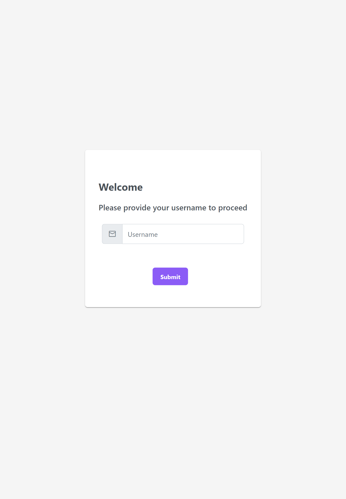
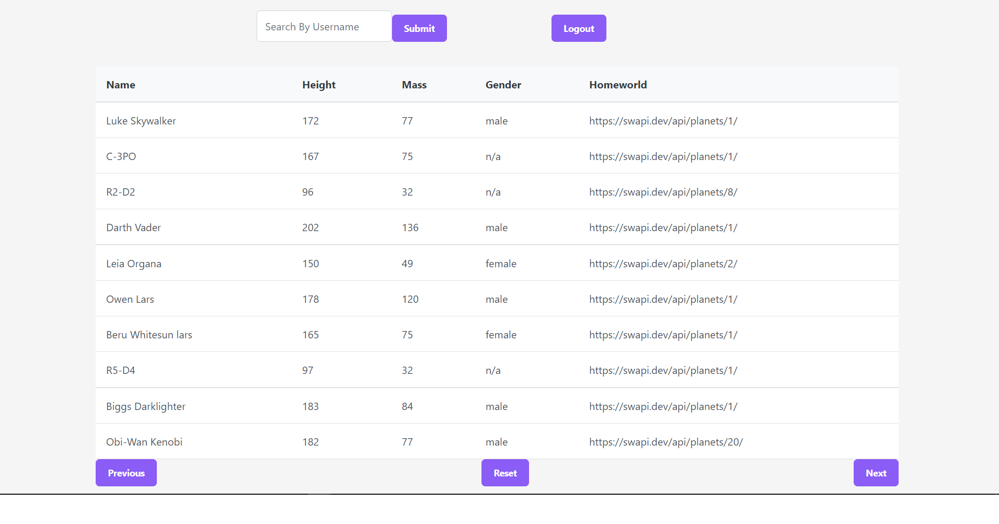

# Sovtech Python Backend Developer Interview

## Deliverables

- You should develop a GraphQL API

- Your GraphQL API should wrap the Star Wars API (https://swapi.dev/).

- It should have an authenticate Mutation that, when given an arbitrary username
returns a JWT ( token ) with the username in the payload

- Your GraphQL API should have a Query type that resolves all People
 (https://swapi.dev/api/people/), but only the Person's details (name, height, mass,
 gender, homeworld).

- The People Query should cater for pagination, you will notice the next property in
the response. When given a page number, the respective People page should be
returned (i.e. https://swapi.dev/api/people/?page=2)

- Your GraphQL API should have a Query type that resolves (searches for) a
particular Person (People) given their name (i.e. https://swapi.dev/api/people/?
search=Anakin Skywalker)

- All your Queries should check and validate a valid JWT issued from the
authenticate Mutation ( token ) passed along, in the headers with each request.


## API Reference

## Python Graphql Api

### Root route
```https
    https://sovtech-graphql.herokuapp.com
```

#### Health Check
```https
  GET /health
```

#### Graphql
- AUTH MUTATION

```https
  POST /graphql
```


| Parameter | Type     | Description                       |
| :-------- | :------- | :-------------------------------- |
| `username`      | `string` | **Required**.|
| Returns a Bearer Token as ``token``

- Sample
```go
    mutation auth{
  authenticate(username:"john"){
    token
  }
}

```

- GET PEOPLE QUERY

```https
  POST /graphql
```


| Parameter | Type     | Description                       |
| :-------- | :------- | :-------------------------------- |
| `page`      | `number` | |
| `search`      | `string` | |
| Returns `next`, 
   | `previous`, `count` and 
   `results{name, height,mass,homeworld,gender}`

- Sample
```go
    query getPeople{
  getPeople(page:1, search:"Luke"){
    next
    previous
    count
    results{name,height,mass,homeworld,gender}
  }
}
{
}
"Authorization":"Bearer <Bearer Token>"
```
## Sovtech-API Environment Variables

To run this service, you will need to add the following environment variable to your .env file

`JWT_SECRET=`


## Run Locally

Clone the project

```bash
  git clone https://github.com/Njuguna-JohnBrian/Sovtech-Python-Developer-Test
```

Go to the project directory

```bash
  cd Sovtech-Python-Developer-Test
```

Install dependencies and Start Services

- Api

  Ensure Python is Installed - [Python Installation](https://www.python.org/downloads/)

  Change Directory ```cd sovtech-api```

  Create Vitual Env ```pip venv <VirtualEnvName>```

  Activate Environment   ```source <VirtualEnvName>/Scripts/activate```

  Install Dependencies ```pip Install -r requirements.txt```

  Run Project ```FLASK_RUN=app.py FLASK_DEBUG=true flask run```


- Front End

Ensure Angular is Installed - [Angular Installation](https://angular.io/guide/setup-local)

Change Directory ```cd sovtech-frontend```

Install Dependancies ``npm i``

Run Project ``ng serve`` or ``ng serve -o``  to open on your browser automatically


## Running Tests

To run tests, run the following commands:

- Api Tests

```bash
  python -m pytest
```

- FrontEnd

```bash
  ng test
```


## Deployment

- To view Project In Deployment

    [Frontend On AWS S3 Bucket](http://sovtech-frontend.s3-website-us-east-1.amazonaws.com/)


    [Backend On Heroku](https://sovtech-graphql.herokuapp.com/graphql)

## Screenshots

### Username Screen


### Query Screen


## Author

- [@Njuguna John Brian Ngugi](https://github.com/Njuguna-JohnBrian)

